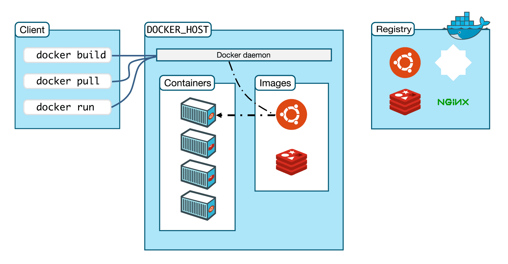

<h1 align="center">LEARN DOCKER</h1>

[https://www.docker.com](https://www.docker.com)

- Docker is a very popular container manager implementation
- Docker is a free & open source application
- Docker is a new technology from 2013

## Docker architecture

- Docker using Client-Server architecture
- Docker client communicate with docker server
- When we installed docker, normally there will be docker client and docker server
- Docker Client and Docker Daemon could possibly running on the same system
- Docker Client and Docker Daemon communicate using REST API



## Docker installation

- for windows and mac > _on windows and mac user could setting the resource that docker will take like how much cpus or memory by easily click preference > resource_ [https://docs.docker.com/get-docker/](https://docs.docker.com/get-docker/)

- for linux user based on your linux distro > _on linux docker will automatically share the resource so its easier_ [https://docs.docker.com/engine/install/](https://docs.docker.com/engine/install/)

## Docker checking

- After you finished install the docker you could check whether docker daemon/docker server is installed already, just by typing on the command line

```
docker version
```

- Before you check where version you are currently on, you need to make sure that your docker server is running or it will return an **error** because basically when you type an command, docker client will send to the docker daemon, so when the docker daemon is shutting down, he couldn`t receive any command from the client
- If the command return the version of your docker it shows that your docker it work properly

## Docker registry

- Docker registry is a place that we store the docker image
- With docker registry you could store your image that you have created, and you could use that on the docker server as long as its connecting to the docker registry


- Now the question is where i can find docker registry
- Well there are some of docker registry that you can find on web
- One of the most popular and free is [Docker Hub](https://hub.docker.com/)

## Docker image

- Docker image is kind of like application installer, where within it contains application and dependencies
- Before you wanna run the application on docker, you need to make sure whether we have that application on docker image.

## List the docker image

- To see the docker image on docker daemon you have, you could simply type

```
docker image ls
```

- That command will list all the image you have
- Also return TAG, the image ID, date created and the image size

  

## Download docker image

- We haven`t known yet how to create a docker image, so we will just download from docker registry, again you can find the image that you want to download from the [Docker Hub](https://hub.docker.com/)
- Command to install image >

```dockerfile
docker image pull imageName:tag

#example

docker image pull redis:bullseye
```

- The tag is optional but if you didn`t provide the tag, it will automatically download the latest version of the docker image
- The docker is pretty smart, when you download image that you have already installed, docker will not execute it, so it won`t put another resource
- How long the download it takes is depends on your internet connection


## Delete docker image

- If you didn`t want to use image you have downloaded, you could simply type:

```dockerfile
docker image rm imageName:tag

#example

docker image rm redis:bullseye
```


- **rm** stands for _remove_
- Check one more time the lis of the image and you`ll see that redis:bullseye will no longer exist

## Docker container

- If the docker image is application installer, docker container is the result of the installation
- A docker image could generate some of docker container as long as the name of the container is not same to other
- When you`ve created a docker container you could not remove the docker image, the reason is because docker container is not actually install the image and put inside the container but just use the content of the image
- Imagine you download application on your phone and then install it, you are allowed to delete the installer because the application is already on your machine and everything works properly, but docker container is not work that way, docker is just use content of the image so if you wanna remove the image you also need to remove the container

## Status container

- When you created a container, it is not running as a default like if you install application, that application won`t run if you did not start using it.
- Because of that behavior, If you want to use that container you need to operate it, after you`ve already installed.

## Check container

- To check all of the container either the container that is running or not, we could use command:

```
docker container ls -a
```

- **-a** stands for _all_
- List of the container is should be empty because we haven`t create any container
- Whereas, if you only wanna list the container that is running, simply remove the `-a`

```
docker container ls
```

## Create container

- To create container, we could use command:

```dockerfile
docker container create --name containerName imageName:tag

#example

docker container create --name redisExample redis:bullseye
```

- A sign that you`ve successfully created a container is it will return the container ID.
- Afterwords you could check the container by the command that we have already learn.
- You should find your container name on the list.
- When you create a container with a image you didn`t have, docker will download the image automatically, **pretty smart**.

## Run container

- For running a container you already created, you could use command:
- Type either **containerId/containerName** after the `start` command.
- Commonly is using containerName because it easily to remember.

```dockerfile
docker container start containerId/containerName

#example

docker container start redisExample
```

- Afterwords if you command `docker container ls` you'll see the list of your container is running with a `up` status and `ports` number which mean that the container is running.

> One container to another is isolated, because of that even they have the same port or one of them is conflict, another container wont be affected.

## Stop container

- When you no longer want to use a container you could just remove it, but it is not allowed if the container is running, so thing you could do is stop the container by using command:

```dockerfile
docker container stop containerId/containerName

#example

docker container stop redisExample
```

- Command `docker container ls -a` and you'll see the status of container you just stopped is `exited` means that the container is no longer running.

## Delete container

- If a container is no longer running that`s a time you could delete a container by just typing:

```dockerfile
docker container containerId/containerName

#example

docker container rm redisExample
```

- When you successfully deleted the container, you'll not see `redisExample` anymore

## Container log

- Sometimes when a problem occurred on a application within the container, We wanna see the detail of the log application or what error we got, so we could easily find the problem and then debug and solve it.


- To see the log application the your container, you could just type:

```dockerfile
docker container logs containerId/containerName

#example

docker container logs redisExample
```

- Or you wanna see realtime log which mean if a new log comes in it will show directly, do by just typing:

```dockerfile
docker container logs -f containerId/containerName

#example

docker container logs -f redisExample
```

## Container exec
